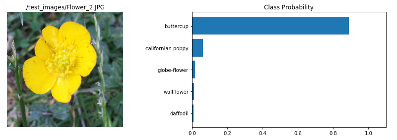

# Flower Image Classifier - Deep Learning

In this project a deep learning network is trained to identify flowers in images. This photo was taken in London and identified as a buttercup, hopefully that is correct!

After creating a pre-processing pipeline, a MobileNet pre-trained network from TensorFlow Hub was loaded and used to create a new feed-forward network as a classifier. Following training using a GPU, the classifier achieves 77% accuracy on the Oxford flower dataset. Finally, the model is saved and is used by python command line application (download and run "python predict.py -h" for usage).

